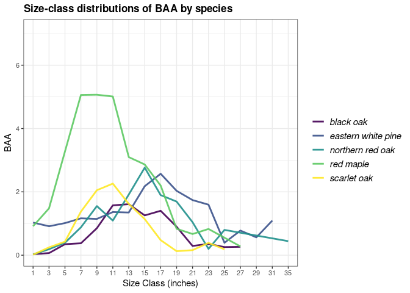
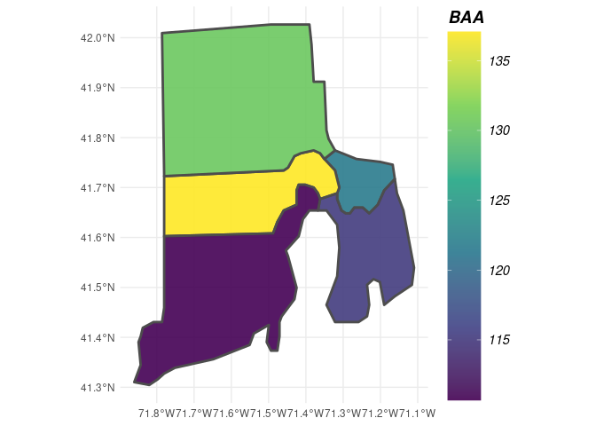

<!-- README.md is generated from README.Rmd. Please edit that file -->

# rFIA: Unlocking the FIA Database in R <a href='https://doserlab.com/files/rfia/'></a>

[](https://CRAN.R-project.org/package=rFIA)
[](https://app.codecov.io/gh/doserjef/rFIA-deleted?branch=master)

## Overview

The goal of `rFIA` is to increase the accessibility and use of the USFS
Forest Inventory and Analysis (FIA) Database by providing a
user-friendly, open source platform to easily query and analyze FIA
Data. Designed to accommodate a wide range of potential user objectives,
`rFIA` simplifies the estimation of forest variables from the FIA
Database and allows all R users (experts and newcomers alike) to unlock
the flexibility and potential inherent to the Enhanced FIA design.

Specifically, `rFIA` improves accessibility to the spatio-temporal
estimation capacity of the FIA Database by producing space-time indexed
summaries of forest variables within user-defined population boundaries.
Direct integration with other popular R packages (e.g., dplyr, sp, and
sf) facilitates efficient space-time query and data summary, and
supports common data representations and API design. The package
implements design-based estimation procedures outlined by Bechtold &
Patterson (2005), and has been validated against estimates and sampling
errors produced by EVALIDator.

For more information and example usage of `rFIA`, check out the numerous
vignettes and example use cases in the
[Articles](https://doserlab.com/files/rFIA/articles/) page on our
website. To report a bug or suggest additions to `rFIA`, please use our
[active issues](https://github.com/doserjef/rFIA/issues) page on GitHub,
or contact [Jeff Doser](https://doserlab.com/) (maintainer).

***To cite*** `rFIA`, please refer to the publication in [Environmental
Modeling and Software](https://doi.org/10.1016/j.envsoft.2020.104664)
(doi: <https://doi.org/10.1016/j.envsoft.2020.104664>).

## Functionality

| `rFIA` Function   | Description                                                        |
|-------------------|--------------------------------------------------------------------|
| `area()`          | Estimate land area in various classes                              |
| `areaChange()`    | Estimate annual change in land area in various classes             |
| `biomass()`       | Estimate biomass and carbon stocks of standing trees               |
| `carbon()`        | Estimate carbon stocks by IPCC forest carbon pools                 |
| `customPSE()`     | Estimate custom variables                                          |
| `clipFIA()`       | Spatial & temporal queries for FIA data                            |
| `diversity()`     | Estimate diversity indices (e.g. species diversity)                |
| `dwm()`           | Estimate volume, biomass, and carbon stocks of down woody material |
| `fsi()`           | Estimate forest stability index for live tree populations          |
| `getDesignInfo()` | Summarize attributes of FIA’s post-stratified inventories          |
| `getFIA()`        | Download FIA data, load into R, and optionally save to disk        |
| `growMort()`      | Estimate recruitment, mortality, and harvest rates                 |
| `intersectFIA()`  | Join attributes of a spatial polygon(s) to FIA’s PLOT table        |
| `invasive()`      | Estimate areal coverage of invasive species                        |
| `plotFIA()`       | Produce static & animated plots of FIA summaries                   |
| `readFIA()`       | Load FIA database into R environment from disk                     |
| `seedling()`      | Estimate seedling abundance (TPA)                                  |
| `standStruct()`   | Estimate forest structural stage distributions                     |
| `tpa()`           | Estimate abundance of standing trees (TPA & BAA)                   |
| `vitalRates()`    | Estimate live tree growth rates                                    |
| `volume()`        | Estimate merchantable volume of standing trees                     |
| `writeFIA()`      | Write in-memory FIA Database to disk                               |

## Installation

You can install the released version of `rFIA` from
[CRAN](https://CRAN.R-project.org) with:

``` r
install.packages("rFIA")
```

Currently, you can install the development version from GitHub:

``` r
devtools::install_github('doserjef/rFIA')
```

## Example Usage

### *Download FIA Data and Load into R*

The first step to using `rFIA` is to download subsets of the FIA
Database. The easiest way to accomplish this is using `getFIA()`. Using
one line of code, you can download state subsets of the FIA Database,
load data into your R environment, and optionally save those data to a
local directory for future use!

``` r
# Download the state FIA data from Connecticut (requires an internet connection)
# All data acquired from FIA Datamart: https://apps.fs.usda.gov/fia/datamart/datamart.html
ct <- getFIA(states = 'CT', dir = '/path/to/save/data')
```

By default, `getFIA()` only loads the portions of the database required
to produce summaries with other `rFIA` functions (`common = TRUE`). This
conserves memory on your machine and speeds download time. If you would
like to download all available tables for a state, simple specify
`common = FALSE` in the call to `getFIA()`.

**But what if I want to load multiple states worth of FIA data into R?**
No problem! Simply specify multiple state abbreviations in the `states`
argument of `getFIA()` (e.g. `states = c('MI', 'IN', 'WI', 'IL'`)), and
all state subsets will be downloaded and merged into a single
`FIA.Database` object. This will allow you to use other `rFIA()`
functions to produce estimates within polygons which straddle state
boundaries!

Note: given the massive size of the full FIA Database, users are
cautioned to only download the subsets containing their region of
interest.

**If you have previously downloaded FIA data and would simply like to
load the data into R from a local directory, use `readFIA()`:**

``` r
# Load FIA Data from a local directory
db <- readFIA('/path/to/your/directory/')
```

------------------------------------------------------------------------

### *Compute Estimates of Forest Variables*

Now that you have loaded your FIA data into R, it’s time to put it to
work. Let’s explore the basic functionality of `rFIA` with `tpa()`, a
function to compute tree abundance estimates (trees per acre (TPA) and
basal area per acre (BAA)) from FIA data, and `fiaRI`, a subset of the
FIA Database for Rhode Island including inventories from 2013-2018.

**Estimate the abundance of live trees in Rhode Island:**

``` r
library(rFIA)
# Load the Rhode Island subset of the FIADB (included w/ rFIA)
# NOTE: This object can be produced using getFIA and/or readFIA
data("fiaRI")

# Only estimates for the most recent inventory year
fiaRI_MR <- clipFIA(fiaRI, mostRecent = TRUE) 
tpaRI_MR <- tpa(fiaRI_MR)
head(tpaRI_MR)
#> # A tibble: 1 × 8
#>    YEAR   TPA   BAA TPA_SE BAA_SE nPlots_TREE nPlots_AREA     N
#>   <dbl> <dbl> <dbl>  <dbl>  <dbl>       <int>       <int> <int>
#> 1  2018  427.  122.   6.63   3.06         126         127   199

# All Inventory Years Available (i.e., returns a time series)
tpaRI <- tpa(fiaRI)
head(tpaRI)
#> # A tibble: 6 × 8
#>    YEAR   TPA   BAA TPA_SE BAA_SE nPlots_TREE nPlots_AREA     N
#>   <dbl> <dbl> <dbl>  <dbl>  <dbl>       <int>       <int> <int>
#> 1  2013  467.  119.   6.64   3.09         120         123   197
#> 2  2014  466.  120.   6.73   3.09         121         123   196
#> 3  2015  444.  121.   6.40   3.06         122         124   194
#> 4  2016  450.  123.   6.46   2.94         124         125   197
#> 5  2017  441.  123.   6.66   3.01         124         125   196
#> 6  2018  427.  122.   6.63   3.06         126         127   199
```

**What if I want to group estimates by species? How about by size
class?**

``` r
# Group estimates by species
tpaRI_species <- tpa(fiaRI_MR, bySpecies = TRUE)
head(tpaRI_species, n = 3)
#> # A tibble: 3 × 11
#>    YEAR  SPCD COMMON_NAME          SCIENTIFIC_NAME      TPA    BAA TPA_SE BAA_SE
#>   <dbl> <dbl> <chr>                <chr>              <dbl>  <dbl>  <dbl>  <dbl>
#> 1  2018    12 balsam fir           Abies balsamea    0.0873 0.0295  114.   114. 
#> 2  2018    43 Atlantic white-cedar Chamaecyparis th… 0.247  0.180    59.1   56.0
#> 3  2018    68 eastern redcedar     Juniperus virgin… 1.14   0.138    64.8   67.5
#> # ℹ 3 more variables: nPlots_TREE <int>, nPlots_AREA <int>, N <int>

# Group estimates by size class
# NOTE: Default 2-inch size classes, but you can make your own using makeClasses()
tpaRI_sizeClass <- tpa(fiaRI_MR, bySizeClass = TRUE)
head(tpaRI_sizeClass, n = 3)
#> # A tibble: 3 × 9
#>    YEAR sizeClass   TPA   BAA TPA_SE BAA_SE nPlots_TREE nPlots_AREA     N
#>   <dbl>     <dbl> <dbl> <dbl>  <dbl>  <dbl>       <int>       <int> <int>
#> 1  2018         1 188.   3.57  13.0   12.8           76         127   199
#> 2  2018         3  68.6  5.76  15.1   15.8           46         127   199
#> 3  2018         5  46.5  9.06   6.51   6.57         115         127   199

# Group by species and size class, and plot the distribution 
# for the most recent inventory year
tpaRI_spsc <- tpa(fiaRI_MR, bySpecies = TRUE, bySizeClass = TRUE)
plotFIA(tpaRI_spsc, BAA, grp = COMMON_NAME, x = sizeClass,
        plot.title = 'Size-class distributions of BAA by species', 
        x.lab = 'Size Class (inches)', text.size = .75,
        n.max = 5) # Only want the top 5 species, try n.max = -5 for bottom 5
```



**What if I want estimates for a specific type of tree (ex. greater than
12-inches DBH and in a canopy dominant or subdominant position) in a
specific area (ex. growing on mesic sites), and I want to group my
estimates by some variable other than species or size class (ex.
ownership group)?**

Easy! Each of these specifications are described in the FIA Database,
and all `rFIA` functions can leverage these data to easily implement
complex queries!

``` r
# grpBy specifies what to group estimates by (just like species and size class above)
# treeDomain describes the trees of interest, in terms of FIA variables 
# areaDomain, just like above, describes the land area of interest
tpaRI_own <- tpa(fiaRI_MR, 
                     grpBy = OWNGRPCD, 
                     treeDomain = DIA > 12 & CCLCD %in% c(1,2),
                     areaDomain = PHYSCLCD %in% c(20:29))
head(tpaRI_own)
#> # A tibble: 2 × 9
#>    YEAR OWNGRPCD   TPA   BAA TPA_SE BAA_SE nPlots_TREE nPlots_AREA     N
#>   <dbl>    <int> <dbl> <dbl>  <dbl>  <dbl>       <int>       <int> <int>
#> 1  2018       30 0.857  3.61   58.9   59.1           3          37   199
#> 2  2018       40 1.48   3.97   25.7   27.7          12          83   199
```

**What if I want to produce estimates within my own population
boundaries (within user-defined spatial zones/polygons)?**

This is where things get really exciting.

``` r
# Load the county boundaries for Rhode Island. You can load your own spatial 
# data using functions in sf
data('countiesRI')

# polys specifies the polygons (zones) where you are interested in producing estimates.
# returnSpatial = TRUE indicates that the resulting estimates will be joined with the 
# polygons we specified, thus allowing us to visualize the estimates across space
tpaRI_counties <- tpa(fiaRI_MR, polys = countiesRI, returnSpatial = TRUE)

plotFIA(tpaRI_counties, BAA) # Plotting method for spatial FIA summaries, also try 'TPA' or 'TPA_PERC'
```



**We produced a really cool time series earlier, how would I marry the
spatial and temporal capacity of `rFIA` to produce estimates across
user-defined polygons and through time?**

Easy! Just hand `tpa()` the full FIA.Database object you produced with
`readFIA()` (not the most recent subset produced with `clipFIA()`). For
stunning space-time visualizations, hand the output of `tpa()` to
`plotFIA()`. To save the animation as a .gif file, simpy specify
`fileName` (name of output file) and `savePath` (directory to save file,
combined with `fileName`).

``` r
# Using the full FIA data set, all available inventories
tpaRI_st <- tpa(fiaRI, polys = countiesRI, returnSpatial = TRUE)

# Animate the output
library(gganimate)
plotFIA(tpaRI_st, TPA, animate = TRUE, legend.title = 'Abundance (TPA)', 
        legend.height = .8)
```
